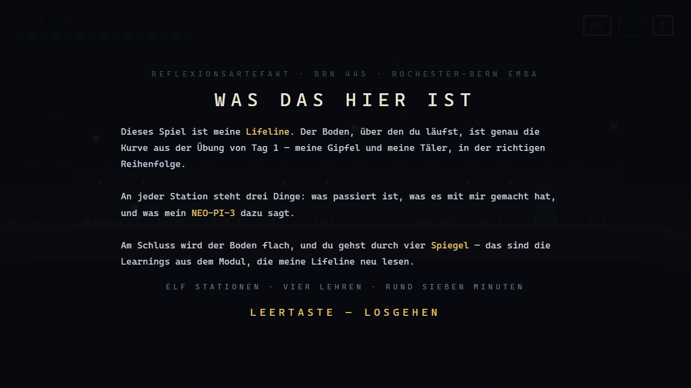
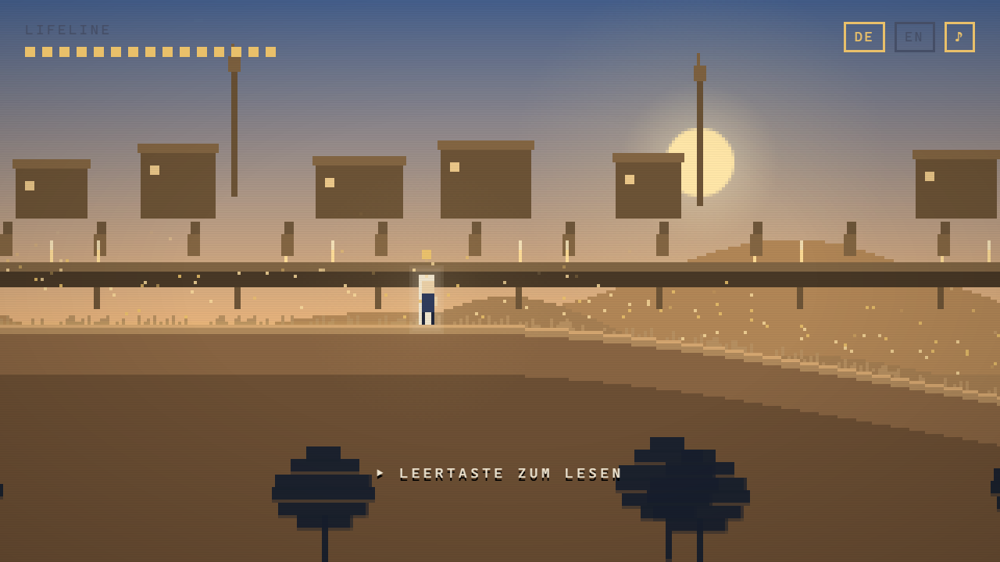
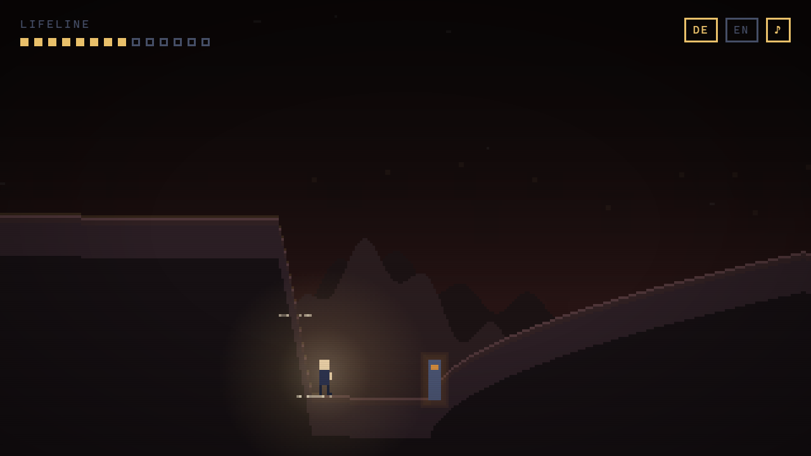
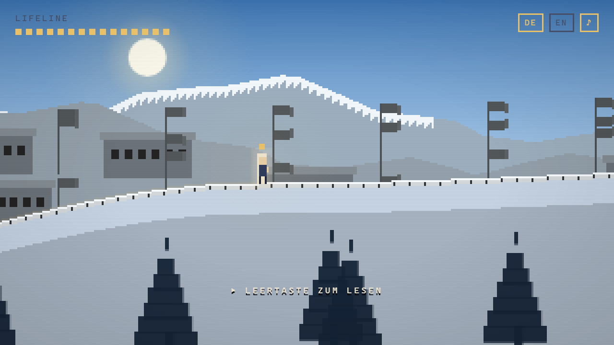
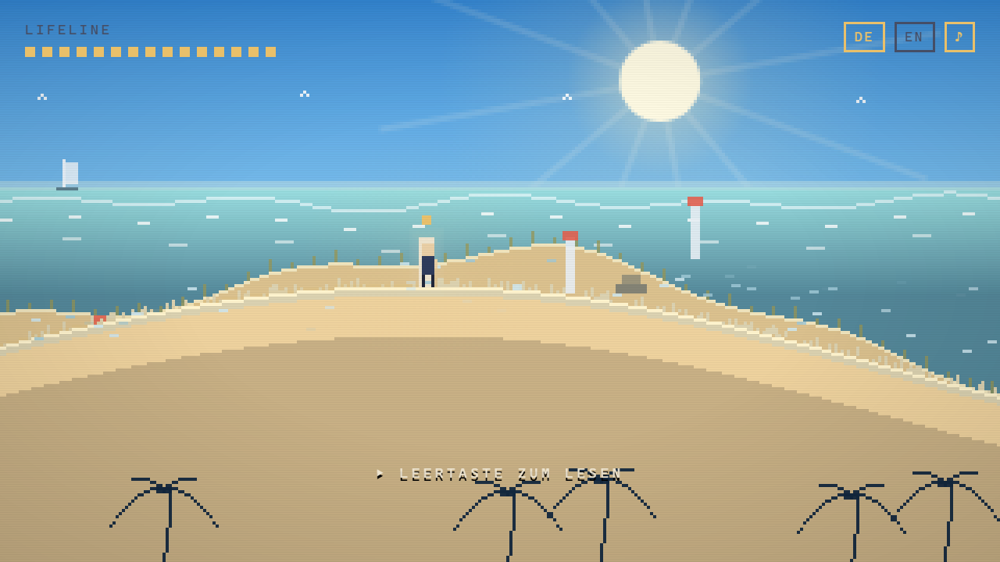
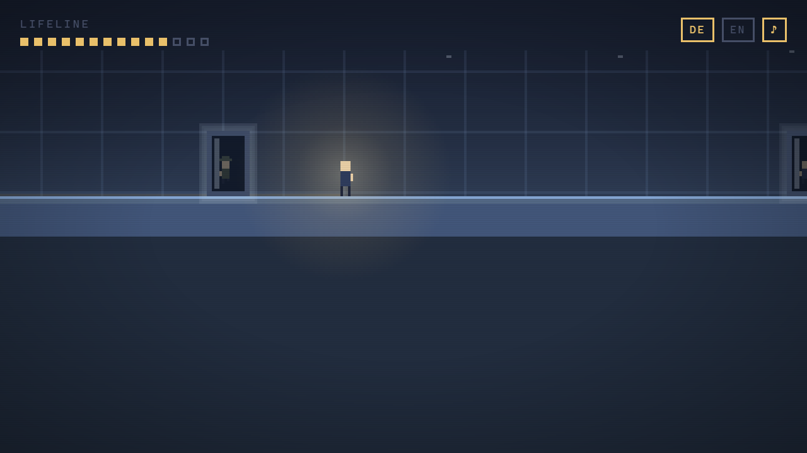
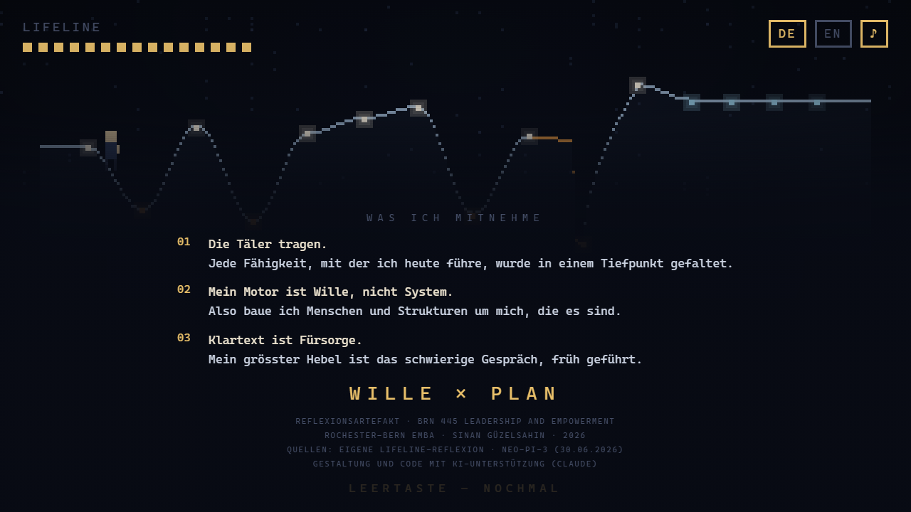

# LIFELINE

**Elf Stationen eines Lebens, vier Lehren aus dem Modul — als Spiel.**

Reflexionsartefakt für **BRN 445 · Leadership and Empowerment**, Rochester-Bern Executive MBA
(Prof. Dr. Katharina Lange, IMD) · Sinan Güzelsahin · 2026

▶ **[Spielen](https://leitung-gif.github.io/lifeline/)** · Pfeiltasten gehen, Leertaste lesen. Mehr braucht es nicht.

Das Spiel erklaert sich zuerst selbst: was es ist, woraus es gebaut ist und was am Ende steht.

---

## Worum es geht

Die Kursaufgabe verlangte ein kreatives Artefakt der wichtigsten Lernerfahrungen — Folien und
Text waren ausdrücklich nicht erlaubt. Also ist es ein Spiel geworden.

Der Clou: **Das Terrain ist die Lifeline.** Der Boden, über den man läuft, ist die Kurve aus der
Lifeline-Übung. Man klettert über die Gipfel und stürzt in die Täler. Die Landschaft ist keine
Dekoration, sie sind die Daten.

Das Spiel hat zwei Akte. **Akt I** ist das Leben: elf Stationen von der Kindheit bis heute.
**Akt II** ist das Modul: Der Boden wird flach und hell, und man geht durch vier Spiegel, in denen
man sein früheres Ich sieht. Dort stehen die Learnings aus dem Kurs — und lesen den ersten Akt neu.

## Die Entscheidungen, die die Reflexion tragen

**Der Boden kann aufhören zu existieren.**
Der Konkurs 2023 wird nicht erzählt, sondern gespielt. Im Dezember 2022 kommt Iara zur Welt —
und wenige Schritte weiter ist der Boden einfach weg. Freier Fall, harter Aufprall, und ab da
humpelt die Figur. Der Weg aus dem Tal ist der steilste im ganzen Spiel, und man geht ihn verletzt.
Erst bei «Heute» richtet man sich wieder auf.

**Das einzige Hindernis im ganzen Spiel ist 2023 — und man kommt nur durch, indem man weitergeht.**
Kein Gegner, kein Geschick, kein Scheitern. Eine Taste, gedrückt gehalten, bis es vorbei ist. Die
Kernlektion aus dem tiefsten Punkt meines Lebens als Spielmechanik: *«Egal wie schlimm — es geht
vorbei.»*

**Man läuft nicht allein.**
Bianca kommt bei der Hochzeit Anfang 2021 dazu, Isac im April 2021, Iara im Dezember 2022 —
wenige Wochen bevor der Boden nachgibt. Sie ist das letzte Licht vor dem Sturz und der Grund,
wieder aufzustehen. Ab dann sind es vier, die gehen.

**Ich wachse sichtbar mit.**
Die Figur beginnt als Kind und wird grösser. Mit vierzehn kommt der Rucksack für Australien
dazu, mit neunzehn die Uniform. Ab dem Militär trägt man ein Licht, das den Boden ausleuchtet —
und die Menschen hinter einem gehen darin. So sieht Führung in diesem Spiel aus: nicht als Befehl,
sondern als getragenes Licht.

**Die Welt verändert sich mit der Lebensphase.**
Jede Station hat ihre eigene Palette, ihren eigenen Horizont und ihre eigene Physik. Der grosse Tisch aus der Kindheit steht als langes
Lichtband am Horizont, 2011 versperrt ein geschlossenes Tor den Weg, in Australien liegen Meer,
Mond und Möwen, 2015 steht der verkaufte Betrieb leer, beim Militär stehen Masten im Gleichtakt,
in Angola Fördertürme unter tiefer Sonne, bei der Hochzeit hängen Lichterketten über dem Weg.
Auch die Luft und der Boden wechseln: aufsteigende Funken, Graupel, Wind, Asche — Grasbüschel,
Risse, Kerben oder Schutt. In Akt II legt sich ein feines Raster über den Himmel: der Plan, der zum
Willen dazukommt.

## Die vier Lehren aus dem Modul

| Spiegel | Was hängen geblieben ist |
|---|---|
| **Leading Self** | Der unbequemste Wert war nicht der höchste, sondern Ordnung z −0.8 neben Selbstdisziplin z +2.5. Mein Motor ist Wille, nicht System — also brauche ich Menschen und Strukturen um mich, die es sind. |
| **Macht & Wirkung** | Mein Machtdefizit ist nicht Autorität, es ist Klartext. Was ich nicht sage, kostet mich Wirkung — und den anderen die Chance, es besser zu machen. |
| **Leading Teams** | Zusammenarbeit ist nicht die Abwesenheit von Konflikt. Ich baue warme Räume; ich muss sie auch ehrlich machen. |
| **Stile** | Vorhand Pacesetting, Rückhand Coaching. Pacesetting skaliert mit meinen Stunden, Coaching verzinst sich. |

## Das Ende

Zum Schluss zeichnet sich die ganze Kurve noch einmal von links nach rechts — elf Stationen,
die Klippe von 2023 in Bernstein, das flache Plateau der vier Spiegel. Man sieht die Form des
eigenen Lebens in einem Bild. Darunter stehen die drei Dinge, die ich mitnehme.

## Bedienung

| Taste | Funktion |
|---|---|
| `←` `→` oder `A` `D` | gehen |
| `LEERTASTE` / `ENTER` | lesen, weiter, starten |
| `DE` / `EN` | Sprache umschalten |
| `♪` | Ton an/aus |

Auf Touchgeräten erscheinen Bildschirmtasten. Eine Runde dauert etwa sieben Minuten.

## Technik

Eine einzige HTML-Datei. Kein Build, keine Abhängigkeiten, keine externen Ressourcen —
`index.html` in den Browser ziehen genügt.

- Canvas 2D bei 320 × 180 Pixel, hochskaliert mit `image-rendering: pixelated`
- Terrain als Interpolation über die Stationshöhen, mit eigenen Kurven für Klippe und Aufstieg
- Echte Fallphysik; die Laufgeschwindigkeit hängt von Steigung und Verletzung ab
- Begleiter folgen einer aufgezeichneten Spur — sie fallen und klettern mit
- Licht statt nur Farbe: jede Station hat einen Tageslichtanteil. Hochs sind heller Tag mit Sonne
  und Luftperspektive, Tiefs sind Regentag, Dämmerung oder Nacht. Vignette, Scanlines, Sterne und
  die getragene Lampe folgen diesem Wert
- Kulissen in drei Tiefen: ferne Bergketten, Meer oder Skyline; mittlere Bauten; eine dunkle
  Vordergrundschicht aus Bäumen, Masten oder Schutt, die schneller vorbeizieht als die Welt
- Paletten, Horizonte und Hintergrundmotive blenden zwischen den Phasen über
- Ton über WebAudio-Oszillatoren, keine Audiodateien
- UI-Text als HTML-Overlay, an die Pixelgrösse gekoppelt (`--u`), damit er auf jeder Auflösung scharf bleibt

## Datengrundlage

- Eigene Lifeline-Reflexion, Rochester-Bern EMBA, Juli 2026
- NEO-PI-3 Persönlichkeitsprofil, 30.06.2026 (Referenz: UK Working Population)
- Kursinhalte BRN 445: Goleman (Leadership That Gets Results), McClelland (Power Is the Great
  Motivator), Edmondson (The Fearless Organization), Gino (Sustained Collaboration)

Alle Inhalte sind autobiografisch. Gestaltung und Code entstanden mit KI-Unterstützung (Claude);
im Abspann des Spiels ist das ebenfalls deklariert.

---

© 2026 Sinan Güzelsahin
