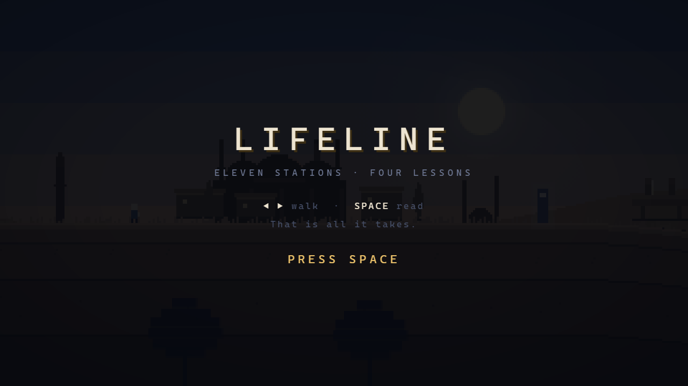
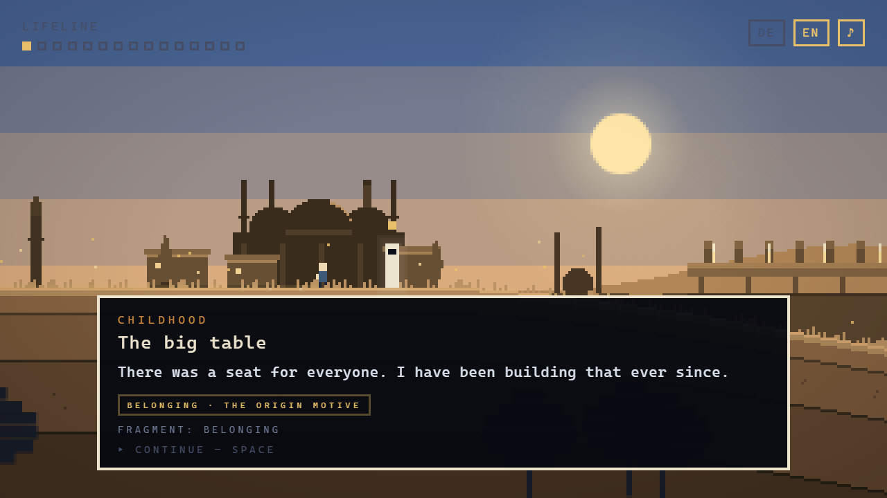
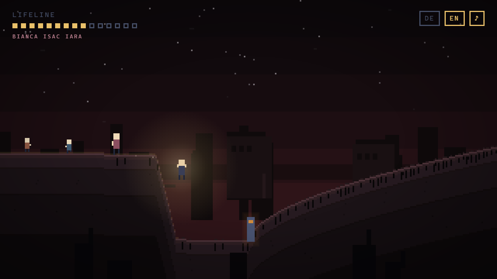
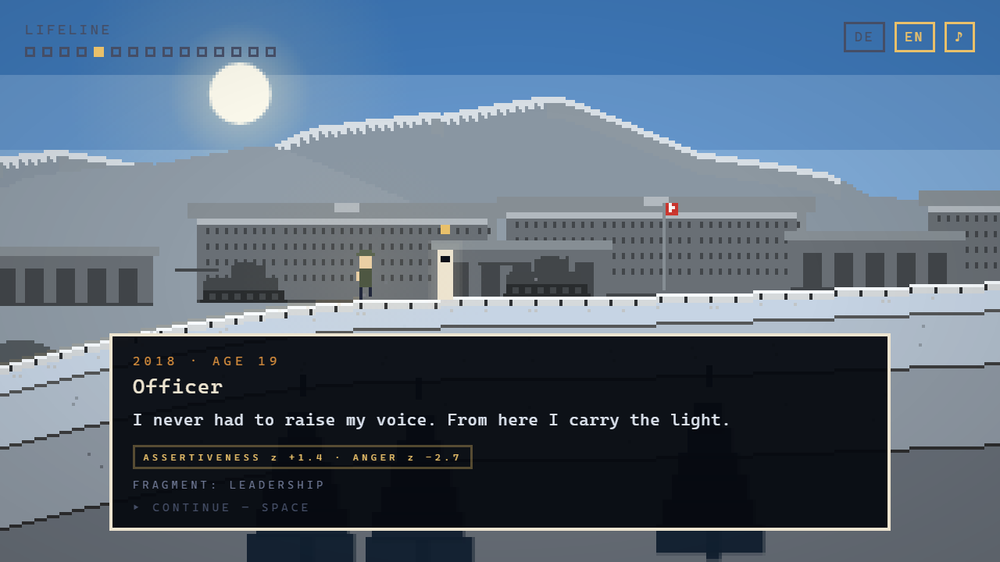
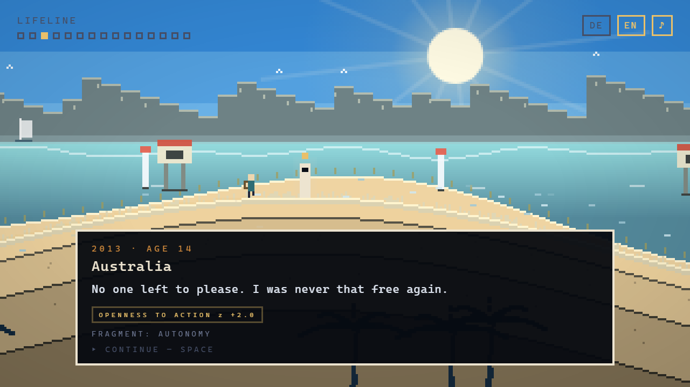
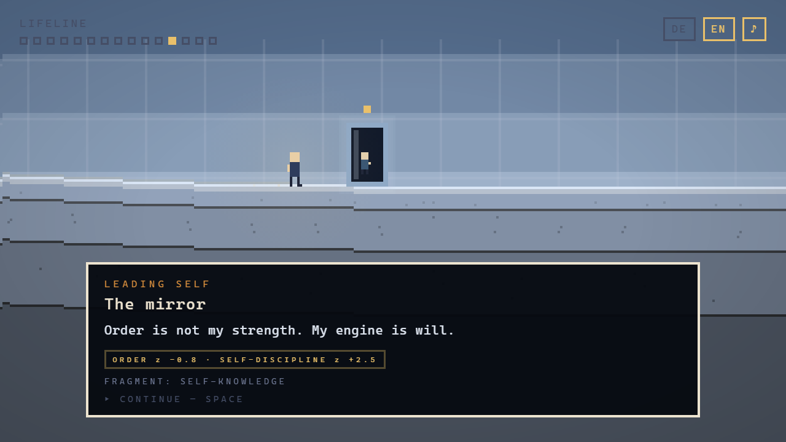
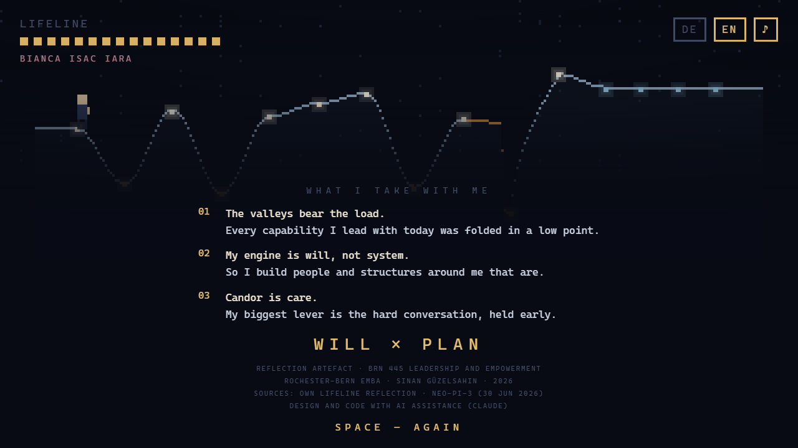

# LIFELINE

**Eleven stations of a life, four lessons from the module — as a game.**

Reflection artefact for **BRN 445 · Leadership and Empowerment**, Rochester-Bern Executive MBA
(Prof. Dr. Katharina Lange, IMD) · Sinan Güzelsahin · 2026

▶ **[Play it](https://leitung-gif.github.io/lifeline/)** · Arrow keys to walk, space to read. That is all it takes.

---

## What this is

The assignment asked for a creative artefact of the most important learning experiences, and ruled
out slides and text. So it became a game.

The idea it rests on: **the terrain is the lifeline.** The ground you walk on is the curve from the
lifeline exercise on day one. You climb over the peaks and you fall into the valleys. The landscape
is not decoration — it is the data.

The game has two acts. **Act I** is the life: eleven stations from childhood to today. **Act II** is
the module: the ground goes flat and pale, and you walk through four mirrors that show you your
earlier self. That is where the lessons from the course sit — and they re-read the first act.

## The decisions that carry the reflection

**The ground is allowed to stop existing.**
The 2023 bankruptcy is not narrated, it is played. In December 2022 Iara is born — and a few steps
later the ground is simply gone. Free fall, hard landing, and from there the character limps. The
climb out of that valley is the steepest in the game, and you walk it injured. Only at "Today" does
the figure straighten up again.

**The only obstacle in the whole game is 2023 — and you get through it by continuing to walk.**
No enemy, no skill check, no way to fail. One key, held down, until it is over. The core lesson from
the lowest point of my life, as a game mechanic: *"No matter how bad — it passes."*

**You do not walk alone.**
Bianca joins at the wedding in early 2021, Isac in April 2021, Iara in December 2022 — weeks before
the ground gives way. She is the last light before the fall and the reason to get back up. From then
on there are four of us walking.

**I grow visibly.**
The character starts as a child and gets bigger. At fourteen the backpack for Australia appears, at
nineteen the uniform. From the army onward you carry a light that illuminates the ground — and the
people behind you walk in it. That is what leadership looks like in this game: not an order, but a
carried light.

**The world changes with the phase of life.**
Every station has its own palette, its own horizon and its own physics. The big table from childhood
stands as a long band of light on the horizon; in 2011 a closed gate blocks the path; in Australia
there is sea, moon and gulls; in 2015 the sold business stands empty; in the army the masts stand in
lockstep; in Angola headframes under a low sun; at the wedding strings of lights hang over the path.
The air and the ground change too: rising embers, sleet, wind, ash — tufts of grass, cracks, notches
or rubble. In Act II a fine grid settles over the sky: the plan that joins the will.

## The four lessons from the module

| Mirror | What stuck |
|---|---|
| **Leading Self** | The most uncomfortable score was not the highest one, but Order z −0.8 next to Self-Discipline z +2.5. My engine is will, not system — so I need people and structures around me that are. |
| **Power & Impact** | My power deficit is not authority, it is candor. What I do not say costs me impact — and costs the other person the chance to do better. |
| **Leading Teams** | Collaboration is not the absence of conflict. I build warm rooms; I have to make them honest too. |
| **Styles** | Forehand pacesetting, backhand coaching. Pacesetting scales with my hours, coaching compounds. |

## The ending

At the end the whole curve draws itself once more, left to right — eleven stations, the 2023 cliff in
amber, the flat plateau of the four mirrors. You see the shape of a life in a single image. Below it
are the three things I take with me.

## Controls

| Key | Action |
|---|---|
| `←` `→` or `A` `D` | walk |
| `SPACE` / `ENTER` | read, continue, start |
| `DE` / `EN` | switch language |
| `♪` | sound on/off |

On touch devices, on-screen buttons appear. A full run takes about seven minutes.

## How it is built

A single HTML file. No build, no dependencies, no external resources — dragging `index.html` into a
browser is enough.

- Canvas 2D at 320 × 180 pixels, upscaled with `image-rendering: pixelated`
- Terrain as an interpolation over the station heights, with its own curves for the cliff and the climb
- Real fall physics; walking speed depends on slope and on injury
- Companions follow a recorded trail — they fall and climb with you
- Light, not just colour: every station has a daylight value. Highs are bright day with sun and
  atmospheric perspective, lows are rain, dusk or night. Vignette, stars and the carried lamp all
  follow that value
- Backdrops in three depths: distant ranges, sea or skyline; middle buildings; a dark foreground layer
  of trees, masts or rubble that moves faster than the world
- Palettes, horizons and background motifs cross-fade between phases
- Sound through WebAudio oscillators, no audio files
- UI text as an HTML overlay, tied to the pixel size (`--u`) so it stays sharp at any resolution

## Sources

- My own lifeline reflection, Rochester-Bern EMBA, July 2026
- NEO-PI-3 personality profile, 30 June 2026 (reference group: UK Working Population)
- BRN 445 course material: Goleman (*Leadership That Gets Results*), McClelland (*Power Is the Great
  Motivator*), Edmondson (*The Fearless Organization*), Gino (*Sustained Collaboration*)

All content is autobiographical. Design and code were made with AI assistance (Claude); this is
declared in the game's credits as well.

---

© 2026 Sinan Güzelsahin
