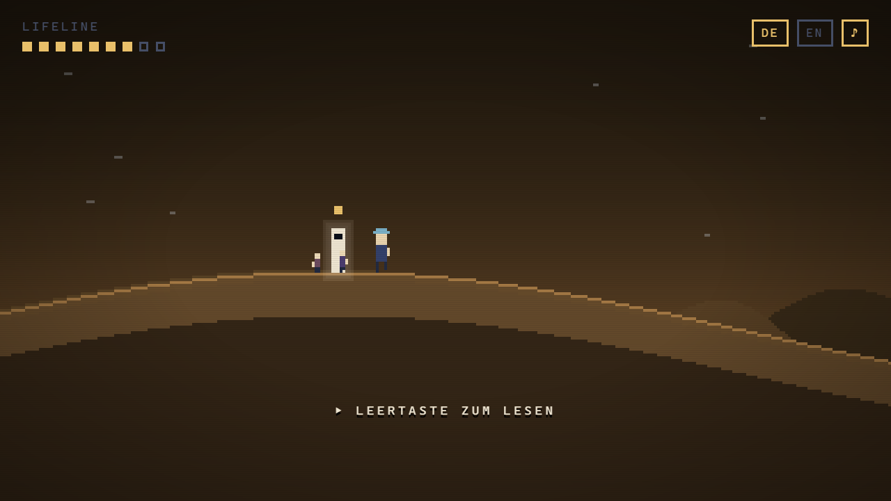
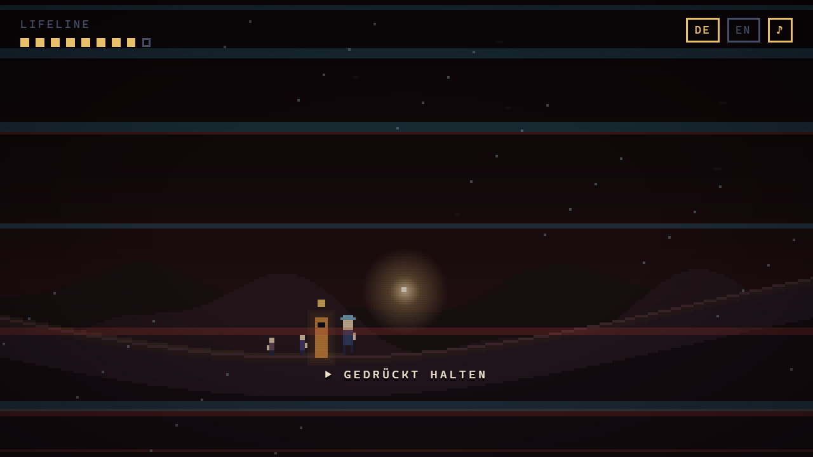
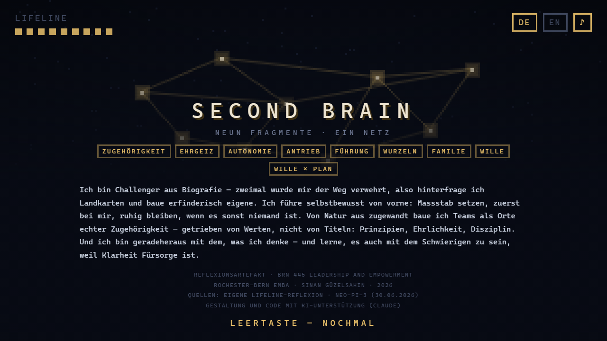

# LIFELINE

**Ein Leben in neun Stationen — als Spiel.**

Reflexionsartefakt für **BRN 445 · Leadership and Empowerment**, Rochester-Bern Executive MBA
(Prof. Dr. Katharina Lange, IMD) · Sinan Güzelsahin · 2026

▶ **[Spielen](https://leitung-gif.github.io/lifeline/)** · Pfeiltasten gehen, Leertaste lesen. Mehr braucht es nicht.

---

## Worum es geht

Die Kursaufgabe verlangte ein kreatives Artefakt der wichtigsten Lernerfahrungen — Folien und
Text waren ausdrücklich nicht erlaubt. Also ist es ein Spiel geworden.

Der Clou: **Das Terrain ist die Lifeline.** Der Boden, über den man läuft, ist exakt die Kurve
aus der Lifeline-Übung — man klettert über die Gipfel und steigt in die Täler hinab. Die
Landschaft ist keine Dekoration, sie ist die Daten.

Neun Stationen, neun Fragmente. Am Ende setzen sie sich zum *Second Brain* zusammen.

## Das Spiel als Aussage

Drei Entscheidungen tragen die Reflexion:

**1. Die Welt verändert sich mit der Lebensphase.**
Jede Station hat ihre eigene Palette und Physik. 2013 (Australien) öffnet sich der Raum und wird
weit und hell. 2015 verliert er fast alle Farbe. Angola wird rotbraun und eng. 2022 bricht die
Darstellung: Chromatik-Versatz, Bildstörungen, Rauschen, gerissene Linien. Das ist Absicht —
manche Jahre waren nicht schön anzusehen, und ein ehrliches Artefakt darf das zeigen.

**2. Das einzige Hindernis im ganzen Spiel ist 2022 — und man kommt nur durch, indem man weitergeht.**
Kein Gegner, kein Geschick, kein Scheitern. Nur eine Taste, gedrückt gehalten, bis es vorbei ist.
Das ist die Kernlektion aus dem tiefsten Punkt meines Lebens, in eine Spielmechanik übersetzt:
*«Egal wie schlimm — es geht vorbei.»* Wille als Game Design.

**3. Man läuft nie allein weiter.**
Ab der Station Familie folgen zwei kleine Figuren. Sie sind der Grund, warum das System nach
jedem Absturz wieder hochfährt.

## Bedienung

| Taste | Funktion |
|---|---|
| `←` `→` oder `A` `D` | gehen |
| `LEERTASTE` / `ENTER` | lesen, weiter, starten |
| `DE` / `EN` | Sprache umschalten |
| `♪` | Ton an/aus |

Auf Touchgeräten erscheinen Bildschirmtasten. Eine Runde dauert etwa vier Minuten.

## Technik

Eine einzige HTML-Datei. Kein Build, keine Abhängigkeiten, keine externen Ressourcen —
`index.html` in den Browser ziehen genügt.

- Canvas 2D bei 320 × 180 Pixel, hochskaliert mit `image-rendering: pixelated`
- Terrain als Kosinus-Interpolation über die neun Stationshöhen
- Paletten werden zwischen den Phasen weich überblendet
- Ton über WebAudio-Oszillatoren, keine Audiodateien
- UI-Text als HTML-Overlay, an die Pixelgrösse gekoppelt (`--u`), damit er auf jeder Auflösung scharf und lesbar bleibt

## Datengrundlage

- Eigene Lifeline-Reflexion, Rochester-Bern EMBA, Juli 2026
- NEO-PI-3 Persönlichkeitsprofil, 30.06.2026 (Referenz: UK Working Population)

Alle Inhalte sind autobiografisch. Gestaltung und Code entstanden mit KI-Unterstützung (Claude);
im Abspann des Spiels ist das ebenfalls deklariert.

---

© 2026 Sinan Güzelsahin
